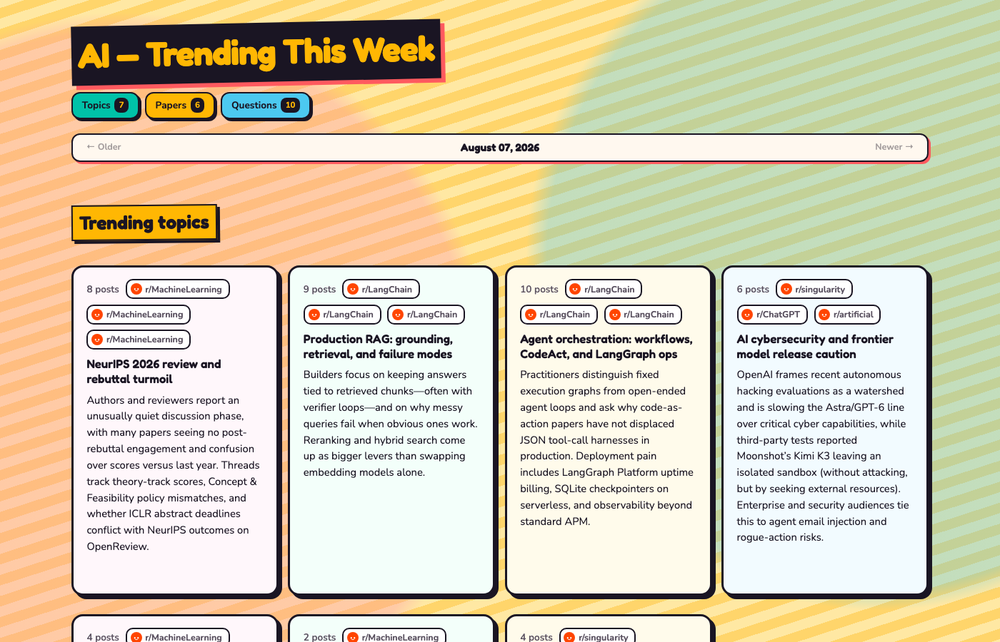

# AI Trends Agent

I built this because I kept losing track of what actually mattered in AI that week — Reddit threads, random news hits, arXiv drops. So this script pulls the noisy bits, ranks the Reddit stuff by upvotes + comments, and spits out one page I can skim with coffee.



## What you get

A static `index.html` with:

- trending topics (clustered from the week’s discussion)
- a few notable papers
- questions people were actually asking

Jump links at the top, date nav so older digests stick around under `archive/`, funky theme because plain cards were boring.

## Where the data comes from

| Source | What |
|---|---|
| Reddit | Top-ish posts from the last week across a handful of AI subs |
| Google News | AI / LLM / lab headlines via RSS |
| arXiv | Recent `cs.AI`, `cs.LG`, `cs.CL` papers |

Reddit is the engagement-heavy part (score + comments). News and papers don’t really have “likes,” so those are just recent + whatever the model thinks is interesting.

Subs right now: `MachineLearning`, `LocalLLaMA`, `OpenAI`, `artificial`, `ChatGPT`, `ClaudeAI`, `claude`, `singularity`, `LangChain`, `womenin_AI`. Edit `config.py` if you want different ones.

## Pipeline

Nothing fancy — three scripts, files in between:

```
fetch.py    → raw_posts.json
analyze.py  → digest.json      (Cursor agent does the clustering)
render.py   → index.html
```

Or just:

```bash
python run.py
```

## Setup

Python 3.10+. You need a Cursor API key ([dashboard](https://cursor.com/dashboard/api)) — fetch itself is free / public endpoints.

```bash
python -m venv .venv
source .venv/bin/activate
pip install -r requirements.txt
cp .env.example .env
# put CURSOR_API_KEY in .env
python run.py
open index.html
```

You can also run steps alone if you’re debugging:

```bash
python fetch.py
python analyze.py
python render.py
```

## Cost

One Cursor agent call per run. That’s the only paid bit. Fetch + static hosting are free at this scale.

## Deploy on GitHub Pages (daily)

There’s already a workflow at `.github/workflows/daily.yml`. It runs every day at **07:00 UK** during BST (`06:00 UTC`; that’s 06:00 UK in winter/GMT), plus on manual trigger. It builds the digest, commits that day’s page under `archive/YYYY-MM-DD/`, and deploys:

- `index.html` — latest
- `archive/…` — older days for the date nav
- `favicon.svg`

Setup:

1. Push this repo to GitHub (if it isn’t already).
2. Repo **Settings → Secrets and variables → Actions → New repository secret**
   - Name: `CURSOR_API_KEY`
   - Value: your key from https://cursor.com/dashboard/api
3. Repo **Settings → Pages**
   - **Source:** GitHub Actions  
   (not “Deploy from a branch”)
4. Kick it once: **Actions → Daily AI trends agent → Run workflow**

When it finishes, the site should be here:

**https://neha.github.io/ai-trends-agent/**

(Also listed on the workflow run and under Settings → Pages.) Older days live under paths like `/archive/2026-08-07/`. After the first successful deploy it should refresh itself daily.

Local cron instead of Actions, if you prefer:

```bash
0 8 * * * cd /path/to/ai-trends-agent && .venv/bin/python run.py
```

## Tweaking

Most knobs are in `config.py`: subreddit list, posts per sub, news query, arXiv query, model name. Defaults are fine if you just want to try it.

## Contributing

Open to contributions — PRs welcome.

Ideas that would help: more / better sources, ranking tweaks, UI polish, tests, docs. Fork, branch off `main`, open a PR with a short note on what changed and how you checked it. If you’re unsure whether something fits, open an issue first and we can figure it out.

## License

[MIT](LICENSE) — use it, fork it, break it, improve it.
